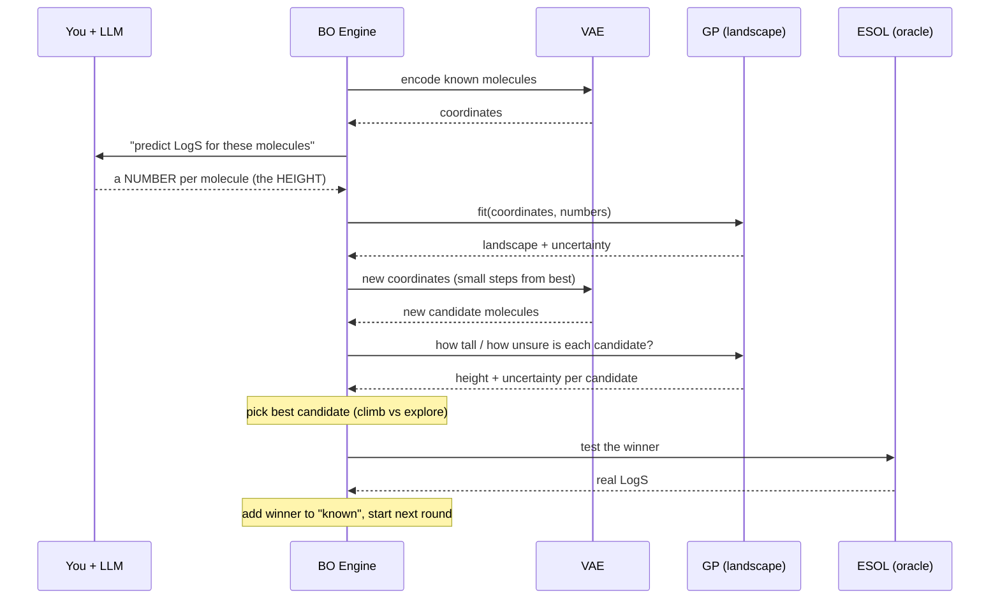
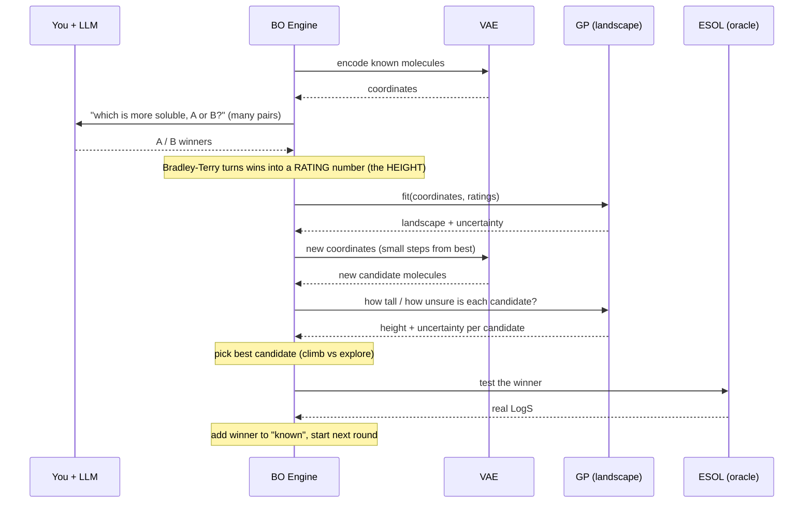
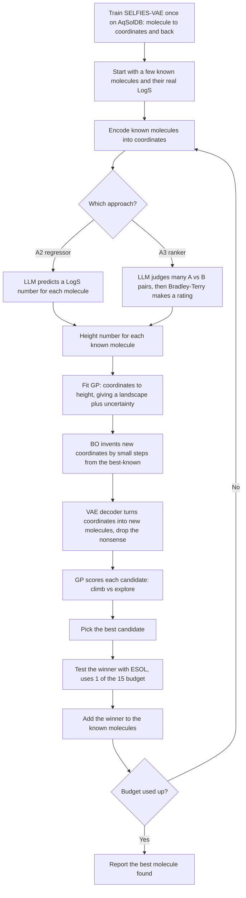

# Approaches 2 and 3, explained from zero

Read this top to bottom. It is one connected story. Every technical word is explained the
first time with a simple picture.

## The big picture: a treasure hunt on a map

Imagine a huge map of "all possible molecules." Every point on the map is one molecule.
At every point there is an **altitude** = how soluble that molecule is in water. Very
soluble molecules are tall mountains. Insoluble ones are deep valleys.

Our whole goal: **find the tallest mountain** (the most soluble molecule).

The catch: the only way to know a point's true altitude is to call **ESOL**, a calculator
that gives the real solubility. We are allowed only 15 calls (the "budget"). So we cannot
measure the whole map. We must be smart about which 15 points we measure.

Everything below is just machinery to spend those 15 measurements wisely and to keep
inventing new points (new molecules) to try.

## Question 1: How are we actually building a molecule?

A molecule is normally written as text, like `CCO` (ethanol). The problem: you cannot
"nudge" text a little and still get a valid molecule. Change one letter and you often get
nonsense.

So we need a **map with coordinates** instead of text. That is what the **VAE** is.

VAE = a small neural network (a trained formula) with two halves:

- **Encoder:** takes a molecule and gives it map coordinates (a list of 64 numbers). Think
  "address -> GPS location."
- **Decoder:** takes any coordinates and turns them back into a molecule. Think
  "GPS location -> the thing at that spot."

Why this is powerful: on this map, **nearby coordinates are similar molecules**, and you
can take a small step to a new coordinate and the decoder gives you a **brand-new but still
valid molecule**. That is literally how we "build" a molecule: pick a coordinate, ask the
decoder, get a molecule. We never write molecule text by hand.

We had to **train** this VAE once (show it ~9,000 real molecules so it learns the "grammar"
of chemistry). It never sees solubility. Its only skill is: molecule <-> coordinates.
Code: `scripts/train_vae.py` builds it, `src/vae.py` uses it.

## Question 2 and "landscape": what is the landscape and how does the GP learn it?

"Landscape" is just the altitude (solubility) over the whole map. We can only afford to
measure a few points. So we need something that looks at a few measured points and
**guesses the whole terrain in between**, like an artist sketching hills from a few known
heights.

That guesser is the **GP** (Gaussian Process). Give it "at these points, the height is
this," and it draws a smooth landscape. Its special trick: it also tells you **how sure**
it is. Near a measured point it is confident. Far from any measured point it says "I really
don't know, could be anything." That honesty about uncertainty is the whole reason we use
it (and it replaces the LLM's unreliable self-confidence from the old Approach 2).

Code: `src/gp.py`. "Fitting the model" just means: feed it the known points so it can draw
the landscape.

## Question 3: what is the BO engine doing?

BO = Bayesian Optimization = the **strategy for the treasure hunt**. Each round it looks at
the GP's guessed landscape and its uncertainty, and decides the next coordinate to actually
build-and-test. It balances two urges:

- **Climb:** go where the landscape looks tall (likely very soluble).
- **Explore:** go where the GP is unsure (might hide a hidden mountain).

It samples many new coordinates near our best-known molecules, asks the decoder to turn
them into real molecules, throws away any nonsense, and scores each with an "acquisition
function" (the climb-vs-explore formula). The winner is the next molecule we test with
ESOL. Then we add that result and repeat. Code: `src/generative_bo.py`.

## Question 4: how is the LLM guessing the number, when you never prompted it?

Here is the honest answer: **it hasn't yet.** In a real run, the program would print a
prompt (a list of molecules with a question), you paste it into ChatGPT/Claude, it gives
back numbers (A2) or A/B choices (A3), and you paste those back in. That manual step has
**not happened** in anything we ran so far. See Question 6 for what we ran instead.

Where the LLM fits: the GP needs "height opinions" to draw the landscape. Calling ESOL for
every opinion would burn our tiny budget. So the **LLM gives cheap opinions** about
molecules, and the GP turns those opinions into the landscape. ESOL is saved for the few
real scores. That is the meaning of "LLM as the surrogate": a cheap stand-in judge.

## Question 5: A3 judges pairs. If it only says "A beats B," how do we get a new molecule?

The pair-judging never builds a molecule directly. It only produces a **ranking**: from
many "A is more soluble than B" answers, we compute a score for each molecule (which ones
tend to win). That ranking is A3's version of "height opinions." From there it is exactly
like A2: the GP turns the ranking into a landscape, the BO engine picks a promising new
coordinate, and the **decoder builds the new molecule** at that coordinate. So the pairs
decide _where to look next_; the decoder is what actually makes the molecule.

Code: `src/approach3/optimizer_approach3_gen.py` (pairs -> ranking -> GP -> new molecule).

## How the opinions become the landscape (the heart of A2 vs A3)

The GP can only draw a landscape if every known molecule has a **height number**. So the
one and only job of the LLM is to give us that height number for each known molecule.

**A2 and A3 are the exact same machine. They differ in only ONE step: how they produce the
height number.**

- **A2 (regressor):** the LLM directly says a number, for example "this molecule's LogS is
  about -1.3." That number **is** the height. Done. Feed (coordinate, number) to the GP.

- **A3 (ranker):** the LLM refuses to give numbers. It only judges pairs: "A is more
  soluble than B." One comparison is not a height. But if we ask many pairs, we can convert
  all those wins and losses into a **rating number** for each molecule, exactly like a chess
  ranking (Elo): players who beat strong opponents get a high rating. The method that does
  this is called **Bradley-Terry**. That rating **is** the height. Feed (coordinate, rating)
  to the GP.

After the height exists, everything is identical: GP draws the landscape, BO invents new
coordinates, the decoder builds molecules, ESOL scores the winner, repeat.

### Sequence diagram: Approach 2 (one round)

### Sequence diagram: Approach 3 (one round)

The only difference between the two diagrams is the top block: A2 gets one number straight
from the LLM; A3 gets many A/B answers and runs Bradley-Terry to turn them into a number.
From "fit the GP" downward they are identical.

### The whole process as one flow diagram

The VAE is trained once at the very top. Everything below the dashed idea is the loop that
repeats until the 15-call budget is gone. The only fork is the "opinion" step (A2 vs A3);
both sides rejoin at "height number."

## Question 6: what is `--auto` mode, and is the project really complete?

To test that this whole machine works, we must run it end to end many times. Prompting a
human-driven LLM hundreds of times is impossible. So we added a practice switch called
`--auto`: it **temporarily replaces the manual LLM with the ESOL calculator** as the
opinion-giver. In practice mode, the machine judges molecules by peeking at ESOL instead of
asking you.

What `--auto` proves: the plumbing works (it encodes, builds new molecules, draws the
landscape, picks, tests, and reliably climbs to more soluble molecules). What it does
**not** give you: real scientific results, because a real experiment must use the real
LLM's opinions, not ESOL pretending to be the LLM.

**So, to be precise:** the **code is complete and tested**. The **experiment is not**,
because you have not done the manual LLM runs yet. When I said "complete" earlier I meant
the machinery. The report needs the real runs. That is the remaining work.

### Can we reuse the LLM answers we already collected?

Only partly. The earlier manual answers were the LLM judging the **old fixed list** of 30
molecules. The new method **invents different molecules every round**, so the LLM has to
judge **those** new molecules, which nobody has shown it yet. Old answers were about
different molecules, so they cannot drive the new loop directly. They are still useful for
one thing: they already measure **how good the LLM is at guessing**, which is a result the
report wants. But for the generative runs you will need fresh answers.

## What to do next (the real experiment)

Run the same commands **without** `--auto`. The program will print prompts; you paste them
into ChatGPT/Claude, paste the answers back, and it records everything. A2 asks for numbers;
A3 asks for A/B choices (A3 needs more comparisons, so it is more typing).

## Code map

| File                                       | Plain job                                         |
| ------------------------------------------ | ------------------------------------------------- |
| `scripts/train_vae.py`                     | trains the molecule builder once                  |
| `src/vae.py`                               | molecule <-> map coordinates (build molecules)    |
| `src/gp.py`                                | draws the solubility landscape + how sure it is   |
| `src/generative_bo.py`                     | picks the next coordinate and builds the molecule |
| `src/approach2/optimizer_approach2_gen.py` | A2: LLM gives numbers                             |
| `src/approach3/optimizer_approach3_gen.py` | A3: LLM judges pairs -> ranking                   |
